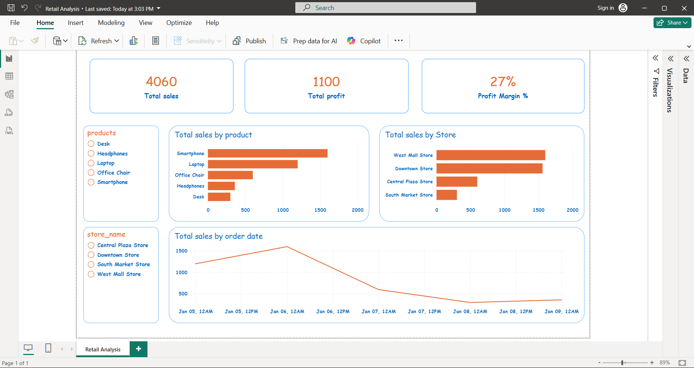

# Retail Sales & Operations Analytics (Power BI)

## Project Overview
This project demonstrates an end-to-end data analytics workflow using SQL and Power BI. 
The objective was to analyze retail sales performance, profitability, and trends to support data-driven business decisions.

## Business Problem
Retail stakeholders need clear visibility into sales, profit, and product/store performance in order to identify top-performing areas and track business trends over time.

## Data Model
The data was modeled using a star schema:
- Fact table: Sales transactions
- Dimension tables: Customers, Products, Stores

The model supports efficient reporting and KPI analysis.

## Key KPIs & Analysis
- Total Sales
- Total Profit
- Profit Margin %
- Sales by Product
- Sales by Store
- Sales Trend Over Time

## Tools & Technologies
- SQL (MySQL)
- Power BI Desktop
- DAX
- GitHub

## Dashboard Features
- Interactive KPI cards
- Product-level and store-level sales analysis
- Time-based sales trend analysis
- Slicers for product, store, and date filtering

## Key Learnings
- Building a star schema for analytics
- Writing DAX measures for business KPIs
- Designing clean and interactive Power BI dashboards
- Translating raw data into actionable business insights

  ## Dashboard Preview

### Home / Overview  

### Slicers and Filters  

